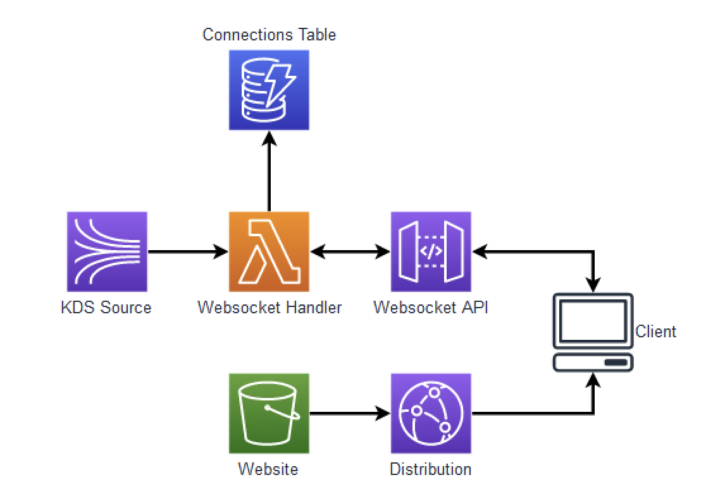

# React based Websocket reader for KDS

## Overview



In this demo, we see how to build a React based Websocket reader to get information from a Kinesis Data Stream to a client in real-time. This can be useful for viewing the contents of a Kinesis Data Stream.

### Components

### Websocket API

This demo uses an [Amazon API Gateway using WebSockets](https://docs.aws.amazon.com/apigateway/latest/developerguide/apigateway-websocket-api.html). Three routes are configured in this API Gateway: $connect, $disconnect, and $default. Connect and Disconnect are used to control connections to the API Gateway. These requests are passed to the Lambda function and stored in the DynamoDB.

```typescript
this.webSocketApi = new WebSocketApi(this, 'webSocketApi', {});

this.webSocketApi.addRoute('$connect', {
  integration: new WebSocketLambdaIntegration(
    'ConnectIntegration',
    this.lambdaHandler,
  ),
});
this.webSocketApi.addRoute('$disconnect', {
  integration: new WebSocketLambdaIntegration(
    'DisconnectIntegration',
    this.lambdaHandler,
  ),
});
this.webSocketApi.addRoute('$default', {
  integration: new WebSocketLambdaIntegration(
    'DefaultIntegration',
    this.lambdaHandler,
  ),
});
```

### Lambda Handler

When the request is made to the Lambda function, the request is processed and information about the connection stored in the DynamoDB.

```typescript
export const handler: Handler = async (event) => {
  if (isAPIGatewayProxyEvent(event)) {
    // WebSocket connection and disconnection handling
    const connectionId = event.requestContext.connectionId;
    console.log('endpoint:  ' + process.env.API_GATEWAY_ENDPOINT);

    if (event.requestContext.eventType === 'CONNECT') {
      await ddbDocClient.send(
        new PutCommand({
          TableName: process.env.CONNECTION_TABLE,
          Item: { connectionId },
        }),
      );
      return { statusCode: 200 };
    } else if (event.requestContext.eventType === 'DISCONNECT') {
      await ddbDocClient.send(
        new DeleteCommand({
          TableName: process.env.CONNECTION_TABLE,
          Key: { connectionId },
        }),
      );
      return { statusCode: 200 };
    }
```

This information will be used when a Kinesis Data Stream record is used to [invoke the Lambda function](https://docs.aws.amazon.com/lambda/latest/dg/with-kinesis.html).

```typescript
this.lambdaHandler = new NodejsFunction(this, 'lambdaHandler', {
  entry: 'src/resources/handler/index.ts',
  runtime: Runtime.NODEJS_18_X,
  architecture: Architecture.ARM_64,
  timeout: Duration.seconds(60),
  role: lambdaHandlerRole,
  environment: {
    STREAM_NAME: props.kinesisDataStream.streamName,
    CONNECTION_TABLE: props.connectionTable.tableName,
    API_GATEWAY_ENDPOINT: `https://${this.webSocketApi.apiId}.execute-api.${this.webSocketApi.stack.region}.amazonaws.com/${this.webSocketStage.stageName}`,
  },
});

new EventSourceMapping(this, 'eventSourceMapping', {
  target: this.lambdaHandler,
  eventSourceArn: props.kinesisDataStream.streamArn,
  startingPosition: StartingPosition.LATEST,
});
```

Here we see the Lambda function being created and `EventSourceMapping` used to trigger the Lambda when a record is added to the Kinesis Data Stream.

```typescript
  } else if (isKinesisStreamEvent(event)) {
    // Kinesis Data Stream processing
    for (const record of event.Records) {
      const kinesisData = Buffer.from(record.kinesis.data, 'base64').toString(
        'utf8',
      );
      console.log('Kinesis Record:', kinesisData);

      const connections = await ddbDocClient.send(
        new ScanCommand({ TableName: process.env.CONNECTION_TABLE }),
      );
      const postData = JSON.parse(kinesisData);

      if (connections.Items) {
        console.log('Connections: ' + JSON.stringify(connections.Items));
        for (const connection of connections.Items) {
          try {
            await apiGatewayManagementApi.send(
              new PostToConnectionCommand({
                ConnectionId: connection.connectionId,
                Data: new TextEncoder().encode(JSON.stringify(postData)),
              }),
            );
          } catch (error) {
            if (
              error instanceof Error &&
              'statusCode' in error &&
              error.statusCode === 410
            ) {
              // Remove stale connections
              await ddbDocClient.send(
                new DeleteCommand({
                  TableName: process.env.CONNECTION_TABLE,
                  Key: { connectionId: connection.connectionId },
                }),
              );
            }
          }
        }
      }
    }
  }
```

Now, when the Lambda is triggered by a KDS event, the Lambda will check if there are any active connections in the DynamoDB. If there are, the record will be written to the API Gateway.

### Client

In the client we will create a connection to the API Gateway so we can receive messages as they arrive.

```typescript
useEffect(() => {
  const ws = new WebSocket(WEB_SOCKET_URL + '/' + WEB_SOCKET_STAGE);

  ws.onopen = () => {
    console.log('Connected to WebSocket');
    setSocket(ws);
    setConnected(true);
  };

  ws.onmessage = (event) => {
    console.log('Received message:', event.data);
    const data: Message = JSON.parse(event.data);
    setMessages((prevMessages) => [...prevMessages, data]);
  };

  ws.onerror = (error: Event) => {
    console.error('WebSocket error:', error);
  };

  ws.onclose = () => {
    console.log('WebSocket connection closed');
    setSocket(null);
    setConnected(false);
  };

  return () => {
    if (ws) {
      ws.close();
    }
  };
}, []);
```

Once the client establishes a connection to the API Gateway, when a message is received, the data will be saved to State and displayed.

```typescript
return (
  <div className='header'>
    {connected ? (
      <div style={{ color: 'green' }}>WebSocket connected</div>
    ) : (
      <div style={{ color: 'red' }}>WebSocket disconnected</div>
    )}
    <button onClick={clearMessages}>Clear</button>
    <div className='messages'>
      <h2>Messages</h2>
      <ul className='message-list'>
        {messages.map((message, index) => (
          <li key={index} className='message'>
            <MessageItem message={message} />
          </li>
        ))}
      </ul>
      <AlwaysScrollToBottom />
    </div>
  </div>
);
```

## Deploy

To deploy this demo:

```
yarn launch
```

## Cleanup

To destroy these components:

```
yarn cdk destroy
```
